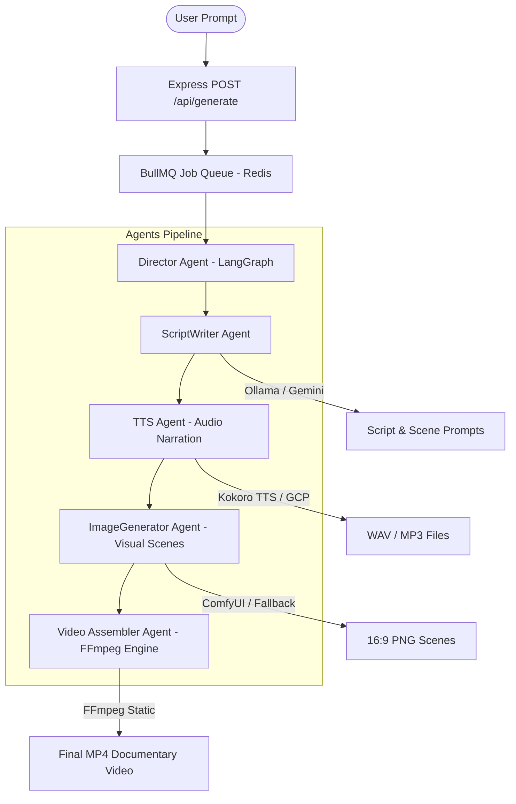

# Loreframe Server 🎬

**Loreframe Server** is an asynchronous, multi-agent AI orchestration backend for generating rich historical documentary videos. It powers the end-to-end documentary pipeline: story generation, scriptwriting, voiceover synthesis, 16:9 scene rendering, audio-visual timing synchronization, and final video assembly.

---

## 📐 Architecture & Pipeline Flow



---

## ⚡ Quick Start (One-Command Setup & Launch)

Loreframe includes an **automated, cross-platform setup runner** (`scripts/setup.mjs`). A single command prepares all dependencies, databases, AI models, Docker containers, and servers.

### 1. Clone & Copy Environment Configuration
```bash
git clone https://github.com/bibinantony1998/Loreframe.git
cd Loreframe
cp .env.example .env
```

### 2. Manual Prerequisite: Ollama & Llama 3.1 Setup
Install and start **Ollama** locally for LLM scriptwriting:

1. **Install Ollama:** Download from [ollama.com](https://ollama.com) or run:
   ```bash
   brew install ollama
   ```
2. **Start Ollama Server:**
   ```bash
   ollama serve
   ```
3. **Pull Llama 3.1 Model:**
   ```bash
   ollama pull llama3.1:8b
   ```
*(Note: Alternatively, set `LLM_PROVIDER="gemini"` and `GOOGLE_API_KEY="your_key"` in `.env` to use Gemini API without local Ollama).*

### 3. Run Unified Setup & Start All Services
```bash
npm start
```

That's it! `npm start` automatically executes the end-to-end setup workflow:

1. **📦 Dependencies Installation:** Installs root backend & `./ui` frontend dependencies.
2. **🗄️ Database Preparation:** Generates Prisma database client & schema migrations (`dev.db`).
3. **🤖 ComfyUI & AI Models Provisioning:**
   - Prepares Python virtual environment (`comfyui/venv`).
   - Downloads **Stable Diffusion 1.5** (`v1-5-pruned-emaonly.ckpt`, 4.07 GB) & **Hyper-SD 4-Step LoRA** (`Hyper-SD15-4steps-lora.safetensors`, 256 MB) with live terminal progress reporting (`⏳ Downloading: 45% (1.8 GB / 4.07 GB)`).
   - Hardlinks models for 100% path compatibility across root and subfolder structures.
   - Auto-imports `Loreframe_Workflow.json` into workspace and sets default canvas settings.
4. **🗣️ Kokoro TTS Docker Engine:** Auto-checks and launches `ghcr.io/remsky/kokoro-fastapi-cpu:latest` container (`kokoro-tts`) on port `8880`.
5. **🧹 Clean Output & File Archiving:** Launches `logStreamer.mjs` to filter HTTP/warning noise from terminal while piping full detailed logs to `./logs/server.log`, `./logs/ui.log`, and `./logs/comfy.log`.

---

## 🌐 Configured Services & Local Endpoints

Once `npm start` completes, all services run concurrently:

| Service | Local URL / Endpoint | Description |
| :--- | :--- | :--- |
| 🖥️ **Frontend UI** | [http://localhost:3000](http://localhost:3000) | Next.js interactive web app for generating & watching documentaries |
| ⚙️ **Backend Server** | [http://localhost:3001](http://localhost:3001) | Express REST API & Real-time WebSocket event stream (`/ws`) |
| 🎨 **ComfyUI Server** | [http://localhost:8188](http://localhost:8188) | Stable Diffusion + Hyper-SD LoRA image generation REST API |
| 🗣️ **Kokoro TTS** | [http://localhost:8880/v1/audio/speech](http://localhost:8880/v1/audio/speech) | High-quality local voiceover speech synthesis container |
| 🦙 **Ollama LLM** | [http://localhost:11434](http://localhost:11434) | Local LLM engine (`llama3.1:8b`) for story structuring |
| 🔴 **Redis** | `redis://localhost:6379` | BullMQ async video generation queue |

---

## 🛠️ Prerequisites & Manual Service Setup

If you prefer to start individual services manually or run background infrastructure separately, review the details below.

### 1. Redis (Queue & Job Management)
Loreframe uses **BullMQ** on top of **Redis** to queue and process video rendering tasks asynchronously.

* **Using Docker (Recommended):**
  ```bash
  docker run -d --name loreframe-redis -p 6379:6379 redis:alpine
  ```
* **Using Homebrew (macOS):**
  ```bash
  brew install redis && brew services start redis
  ```

### 2. Ollama (Local LLM Engine)
1. **Install Ollama:** Download from [ollama.com](https://ollama.com).
2. **Start Server:** `ollama serve` (default port `11434`).
3. **Pull Model:** `ollama pull llama3.1:8b`

### 3. Kokoro TTS (Voiceover Engine)
Kokoro TTS runs via Docker container:
```bash
docker run -d --name kokoro-tts -p 8880:8880 ghcr.io/remsky/kokoro-fastapi-cpu:latest
```
*(Default voice: `am_adam` - deep American male narrator)*

---

## 🛰️ API Endpoints

### 1. Health Check
* **GET** `/health` or `/api/health`
* **Response:**
  ```json
  {
    "status": "ok",
    "timestamp": "2026-08-12T10:00:00.000Z",
    "environment": "development",
    "database": "connected"
  }
  ```

### 2. Generate Historical Documentary Video
* **POST** `/api/generate`
* **Headers:** `Content-Type: application/json`
* **Body:**
  ```json
  {
    "prompt": "The Rise and Fall of the Roman Colosseum",
    "targetDurationMinutes": 2
  }
  ```
* **Response:**
  ```json
  {
    "jobId": "cm...123",
    "status": "QUEUED",
    "message": "Video generation job queued successfully"
  }
  ```

---

## 📁 Output Assets & Log Directories

Media assets & logs are automatically organized:
* `/public/audio/`: Synthesized narration voiceovers (`.mp3` / `.wav`)
* `/public/images/`: 16:9 scene visuals rendered by ComfyUI (`.png`)
* `/public/videos/`: Final assembled documentary MP4 video files (`.mp4`)
* `/logs/server.log`: Detailed backend agent logs & stack traces
* `/logs/ui.log`: Frontend Next.js compilation & network logs
* `/logs/comfy.log`: ComfyUI Python engine logs

---

## 🧯 Troubleshooting & Fallbacks

* **Unsaved Canvas Draft in ComfyUI:** If opening `http://localhost:8188` displays missing model warnings for old workflows (`qwen` / `z_image`), click **Workflow ➔ Open** in ComfyUI and select **`Loreframe_Workflow.json`**.
* **ComfyUI Fallback:** If ComfyUI is unavailable or encounters GPU memory limits, Loreframe automatically generates dynamic gradient vector poster scenes via `Sharp` as a visual fallback so video assembly never fails.
* **Kokoro TTS Fallback:** If Kokoro TTS is unreachable, Loreframe generates clear PCM tone audio buffers to ensure sequence sync remains intact.
